# Домашнее задание к занятию "9.Процессы CI/CD"

## Подготовка к выполнению

---
#### 1. Создаём 2 VM в yandex cloud со следующими параметрами: 2CPU 4RAM Centos7(остальное по минимальным требованиям)

        1) На management хосте создаём  нового юзера bes ,отличного от root .  
        2) Генерируем для него ключ id_rsa.pub .  
        3) На YC под данным юзером  cоздаем 2 виртуалки с заданными параметрами .   
        4) Вносим данного пользователя в файл hosts.yml

#### 2. Прописываем в [inventory](./infrastructure/inventory/cicd/hosts.yml) [playbook'a](./infrastructure/site.yml) созданные хосты  . Добавляем в hosts.yml юзера bes  .
#### 3. Добавляем в [files](./infrastructure/files/) файл со своим публичным ключом юзера  bes (id_rsa.pub).
#### 4. Выполняем проверку кода ./infrastructure/site.yml  с помощью ansible-lint  . Исправляем ошибки . Меняем  собственника на директорию проекта на bes .
#### 5. Запускаем playbook, ожидаем успешного завершения.
#### 6. Проверяем готовность Sonarqube через [браузер](http://158.160.46.194:9000)

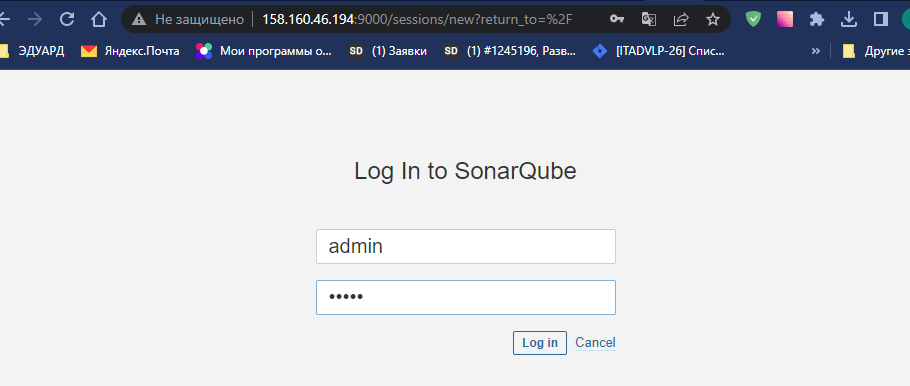

7. Заходим под admin\admin, меняем пароль на свой -admin123
8. Проверяем готовность Nexus через [браузер](http://158.160.18.219:8081)
9. Подключаемся под admin\admin123, меняем пароль а admin456, сохраняем анонимный доступ

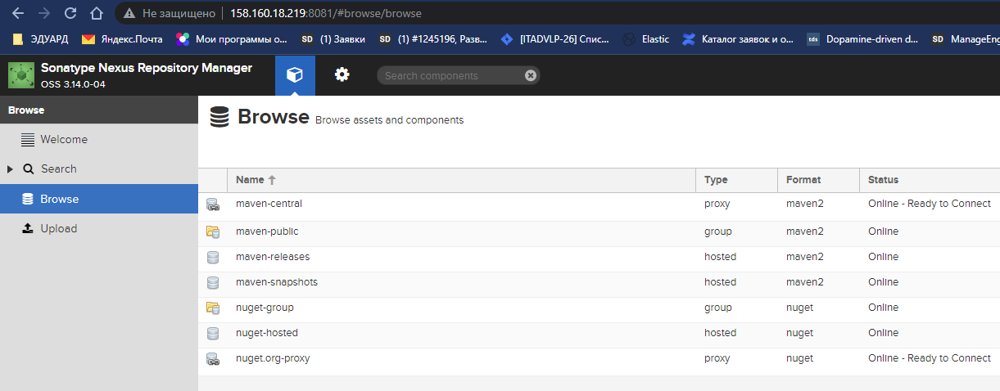

## Знакомоство с SonarQube

### Основная часть

### 1. Создаём новый локальный проект. Для этого 
   Исходник проекта будет располагаться на management хосте  в каталоге (./home/bes/09-ci-03-cicd/example/fail.py)

### 2. В интерфейсе SonarQube генерим  имя и уникальный  токен проекта:

### Выбираем локальный инструмент анализа кода.

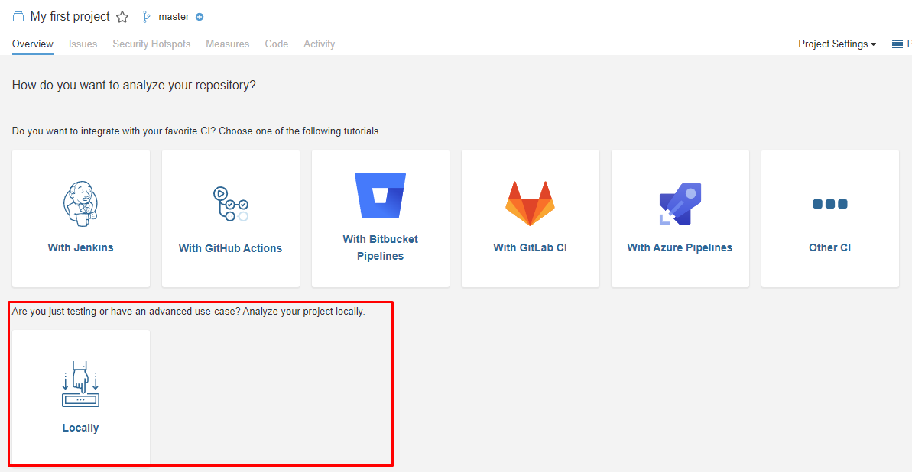

### 4. На management-хосте скачиваем  и устанавливаем пакет sonar-scanner, который нам предлагает скачать сам sonarqube по ссылке
   [https://docs.sonarqube.org/latest/analyzing-source-code/scanners/sonarscanner/]

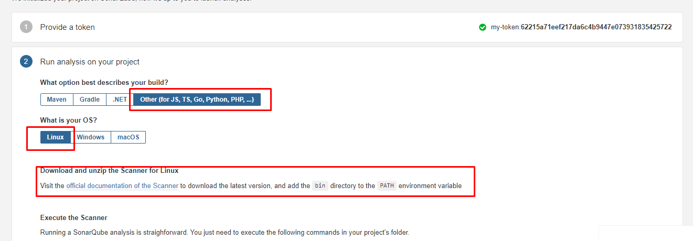

       [root@centos-host /opt/#  wget https://binaries.sonarsource.com/Distribution/sonar-scanner-cli/sonar-scanner-cli-4.7.0.2747-linux.zip
       --2023-01-16 00:59:25--  https://binaries.sonarsource.com/Distribution/sonar-scanner-cli/sonar-scanner-cli-4.7.0.2747-linux.zip
       Распознаётся binaries.sonarsource.com (binaries.sonarsource.com)… 13.33.243.70, 13.33.243.94, 13.33.243.96, ...
       Подключение к binaries.sonarsource.com (binaries.sonarsource.com)|13.33.243.70|:443... соединение установлено.
       HTTP-запрос отправлен. Ожидание ответа… 200 OK
       Длина: 43162003 (41M) [application/zip]
       Сохранение в: «sonar-scanner-cli-4.7.0.2747-linux.zip»
   
       sonar-scanner-cli-4.7.0.2747-linux.zip   100%[==================================================================================>]  41,16M  2,66MB/s    за 16s
   
       2023-01-16 00:59:42 (2,60 MB/s) - «sonar-scanner-cli-4.7.0.2747-linux.zip» сохранён [43162003/43162003]

### 5. В корневом каталоге проекта создаём файл sonar-project.properties со следующим содержимым. Вносим  в файл свойств проекта имя проекта и его уникальный токен.
       
       [root@centos-host /home/bes/09-ci-03-cicd/example/#  cat sonar-project.properties
       # must be unique in a given SonarQube instance
       sonar.projectKey=62215a71eef217da6c4b9447e073931835425722

       # --- optional properties ---

       # defaults to project key
       sonar.projectName=My First Project

       # defaults to 'not provided'
       #sonar.projectVersion=1.0

       # Encoding of the source code. Default is default system encoding
       #sonar.sourceEncoding=UTF-8

### 6. Делаем так, чтобы binary был доступен через вызов в shell.  Для этого меняем переменную PATH.
       
        [root@centos-host /opt/# unzip sonar-scanner-cli-4.7.0.2747-linux.zip  
        [root@centos-host /opt/# export PATH=$PATH:/opt/sonar-scanner/bin

### 7. Редактируем настройки сканера, указывая на удаленный хост с сервером SONAR-QUBE в облаке YC.

        [root@centos-host /opt/sonar-scanner/conf]#  cat sonar-scanner.properties
           #Configure here general information about the environment, such as SonarQube server connection details for example
           #No information about specific project should appear here

           #----- Default SonarQube server
           sonar.host.url=http://158.160.46.194:9000

           #-----  Default SonarQube server login & password
           sonar.login=admin
           sonar.password=admin123 

           #----- Default source code encoding
           sonar.sourceEncoding=UTF-8

### 8. Проверяем работу сканера. Обязательно переходим в корень проекта и запускаем `sonar-scanner --version`

        [root@centos-host example]# cd /home/bes/09-ci-03-cicd/example 
        [root@centos-host example]# sonar-scanner --version
        INFO: Scanner configuration file: /opt/sonar-scanner/conf/sonar-scanner.properties
        INFO: Project root configuration file: /home/bes/09-ci-03-cicd/example/sonar-project.properties
        INFO: SonarScanner 4.7.0.2747
        INFO: Java 11.0.14.1 Eclipse Adoptium (64-bit)
        INFO: Linux 4.18.0-408.el8.x86_64 amd64
        [root@centos-host example]#

### 9. Запускаем анализатор против кода из директории [example](./example) 
с дополнительным ключом `-Dsonar.coverage.exclusions=fail.py`
    
        [root@centos-host example]#  sonar-scanner -Dsonar.coverage.exclusions=fail.py

### 10. Смотрим результат в интерфейсе - файл fail.py проигнорирован.   

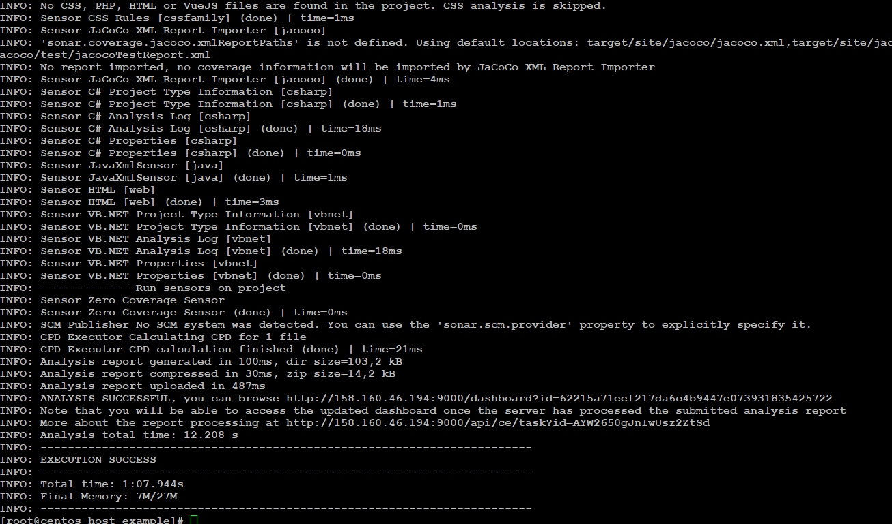

### 11. Запускаем  без ключа и затем исправляем ошибки, которые он выявил(включая warnings).  

         [root@centos-host example]#  sonar-scanner

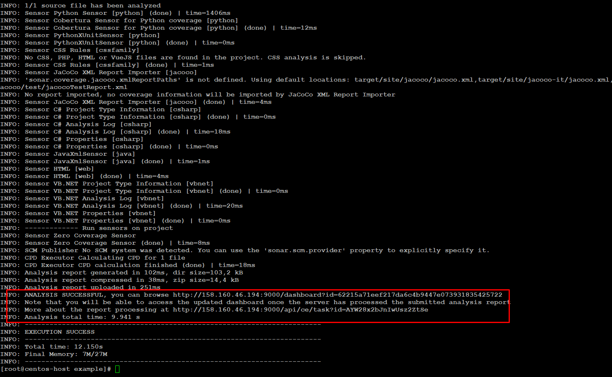
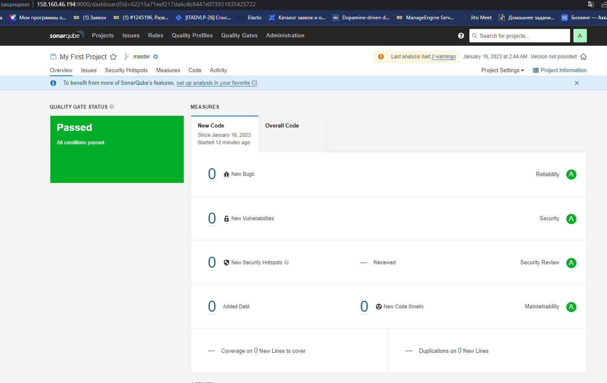

Warnings:

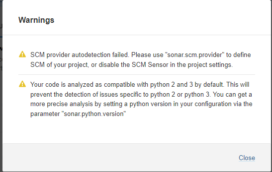

### -- Отключаем опцию SCM
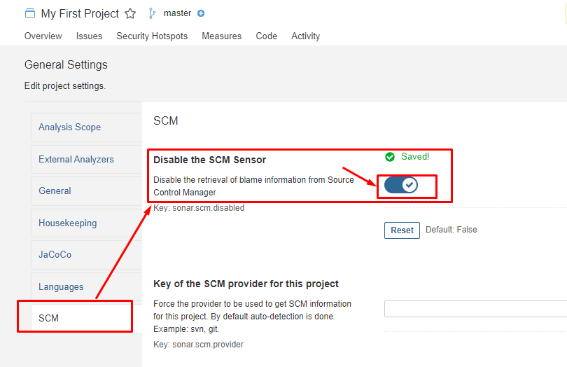

### -- Указываем явно тестируемые версии Python в файле /opt/sonar-scanner/conf/sonar-scanner.properties

         [root@centos-host conf]# cat sonar-scanner.properties
         #Configure here general information about the environment, such as SonarQube server connection details for example
         #No information about specific project should appear here

         #----- Default SonarQube server
         sonar.host.url=http://158.160.46.194:9000

         #----- Default source code encoding
         sonar.sourceEncoding=UTF-8

         #--Default Python vesions
         sonar.python.version=3.8, 3.9

         #-----  Default SonarQube server login
         sonar.login=admin
         sonar.password=admin123

### 12. Запускаем анализатор повторно - проверяем, что QG пройдены успешно
### 13. Делаем скриншот успешного прохождения анализа, прикладываем к решению ДЗ

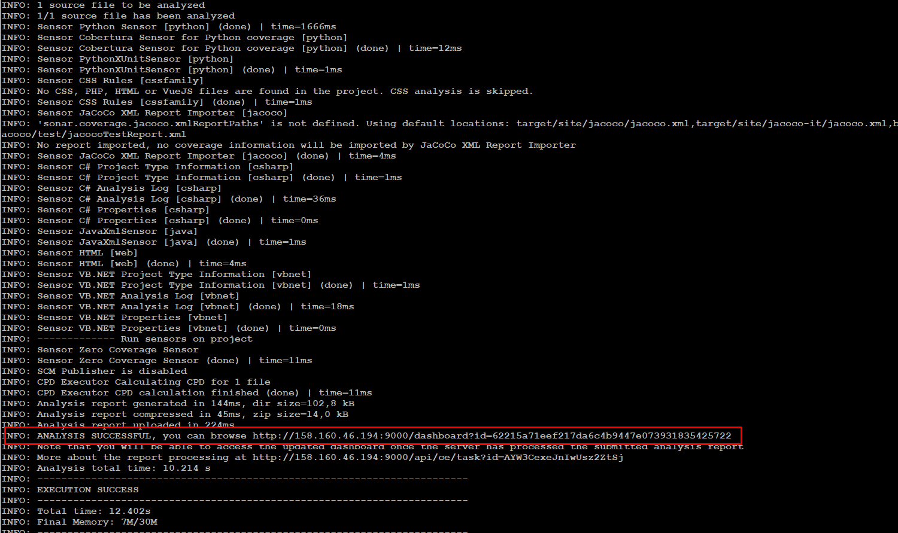
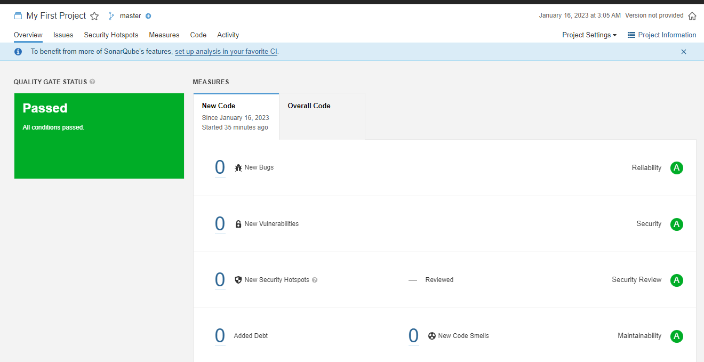

---
## Знакомство с Nexus

### Основная часть

1. В репозиторий `maven-public` загружаем артефакт с GAV параметрами:
   1. groupId: netology
   2. artifactId: java
   3. version: 8_282
   4. classifier: distrib
   5. type: tar.gz
2. В него же загружаем такой же артефакт, но с version: 8_102
3. Проверяем, что все файлы загрузились успешно

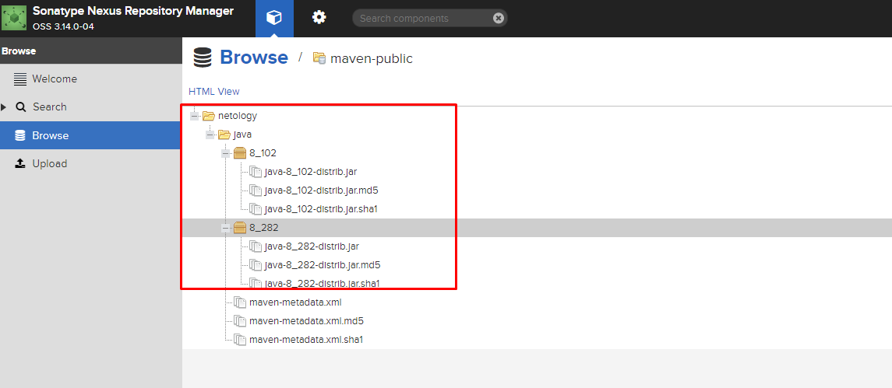

4. Файл конфигурации артефакта`maven-metadata.xml`  - помещаем  в ответ Д.З.

#### [https://github.com/edward-burlakov/mnt-homeworks/blob/master/09-ci-03-cicd/example/maven-metadata.xml]

---
## Знакомство с Maven

### Подготовка к выполнению

### 1. Скачиваем дистрибутив с [maven](https://maven.apache.org/download.cgi)
   
         [root@centos-host /opt/#  wget https://dlcdn.apache.org/maven/maven-3/3.8.7/binaries/apache-maven-3.8.7-bin.tar.gz
         
       
### 2. Разархивируем, делаем так, чтобы binary был доступен через вызов в shell  - меняем переменную PATH или любой другой удобный вам способ)

         [root@centos-host /opt/# export PATH=/opt/apache-maven-3.8.7/bin:$PATH

### 3. Проверяем все варианты JAVA-релизов на management-хосте .

        [root@centos-host bash-completion]# java -version
        openjdk version "1.8.0_352"
        OpenJDK Runtime Environment (build 1.8.0_352-b08)
        OpenJDK 64-Bit Server VM (build 25.352-b08, mixed mode)

        [root@centos-host apache-maven-3.8.7]# alternatives --list  | grep java
        java                    auto    /usr/lib/jvm/java-1.8.0-openjdk-1.8.0.352.b08-2.el8.x86_64/jre/bin/java
        jre_openjdk             auto    /usr/lib/jvm/java-1.8.0-openjdk-1.8.0.352.b08-2.el8.x86_64/jre
        jre_1.8.0               auto    /usr/lib/jvm/java-1.8.0-openjdk-1.8.0.352.b08-2.el8.x86_64/jre
        jre_1.8.0_openjdk       auto    /usr/lib/jvm/jre-1.8.0-openjdk-1.8.0.352.b08-2.el8.x86_64

### 4. Устанавливаем переменную JAVA_PATH на management-хосте,   указывая на пакет jre_1.8.0.

        [root@centos-host bin]# export JAVA_HOME=/usr/lib/jvm/java-1.8.0-openjdk-1.8.0.352.b08-2.el8.x86_64/jre
        [root@centos-host bin]# echo $JAVA_HOME
        /usr/lib/jvm/java-1.8.0-openjdk-1.8.0.352.b08-2.el8.x86_64/jre

### 4. Удаляем из `apache-maven-<version>/conf/settings.xml` упоминание о правиле, отвергающем http соединение( раздел mirrors->id: my-repository-http-unblocker)

    Удаляем блок
    <mirror>
      <id>maven-default-http-blocker</id>
      <mirrorOf>external:http:*</mirrorOf>
      <name>Pseudo repository to mirror external repositories initially using HTTP.</name>
      <url>http://0.0.0.0/</url>
      <blocked>true</blocked>
    </mirror>

### 5. Проверяем `mvn --version`

       [root@centos-host /]# mvn --version
       Apache Maven 3.8.7 (b89d5959fcde851dcb1c8946a785a163f14e1e29)
       Maven home: /opt/apache-maven-3.8.7
       Java version: 1.8.0_352, vendor: Red Hat, Inc., runtime: /usr/lib/jvm/java-1.8.0-openjdk-1.8.0.352.b08-2.el8.x86_64/jre
       Default locale: ru_RU, platform encoding: UTF-8
       OS name: "linux", version: "4.18.0-408.el8.x86_64", arch: "amd64", family: "unix"

### 6. Забираем директорию [mvn](./mvn) с pom

### Основная часть

1. Меняем в `pom.xml` блок с зависимостями под наш артефакт из первого пункта задания для Nexus (java с версией 8_282)

       <groupId>netology</groupId>
       <artifactId>java</artifactId>
       <version>8_282</version>
       <repositories>
        <repository>
          <id>my-repo</id>
          <name>maven-public</name>
          <url>http://158.160.18.219:8081//repository/maven-public/</url>
        </repository>
       </repositories>

2. Запускаем команду `mvn package` в директории с `pom.xml`, ожидаем успешного окончания пакетов

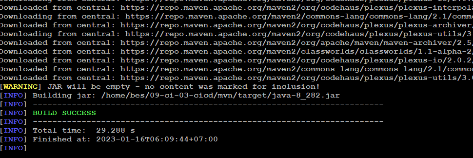

3. Проверяем директорию `~/.m2/repository/`, находим наш артефакт

        [root@centos-host repository]# pwd
        /root/.m2/repository
        [root@centos-host repository]# ls -la
        итого 0
        drwxr-xr-x. 11 root root 167 янв 16 06:09 .
        drwxr-xr-x.  3 root root  24 янв 16 06:09 ..
        drwxr-xr-x.  3 root root  38 янв 16 06:09 backport-util-concurrent
        drwxr-xr-x.  3 root root  25 янв 16 06:09 classworlds
        drwxr-xr-x.  3 root root  20 янв 16 06:09 com
        drwxr-xr-x.  3 root root  25 янв 16 06:09 commons-cli
        drwxr-xr-x.  3 root root  26 янв 16 06:09 commons-lang
        drwxr-xr-x.  3 root root  33 янв 16 06:09 commons-logging
        drwxr-xr-x.  3 root root  19 янв 16 06:09 junit
        drwxr-xr-x.  3 root root  19 янв 16 06:09 log4j
        drwxr-xr-x.  6 root root  65 янв 16 06:09 org

4. В ответ включен исправленный файл `pom.xml`

### [https://github.com/edward-burlakov/mnt-homeworks/blob/master/09-ci-03-cicd/mvn/pom.xml]

